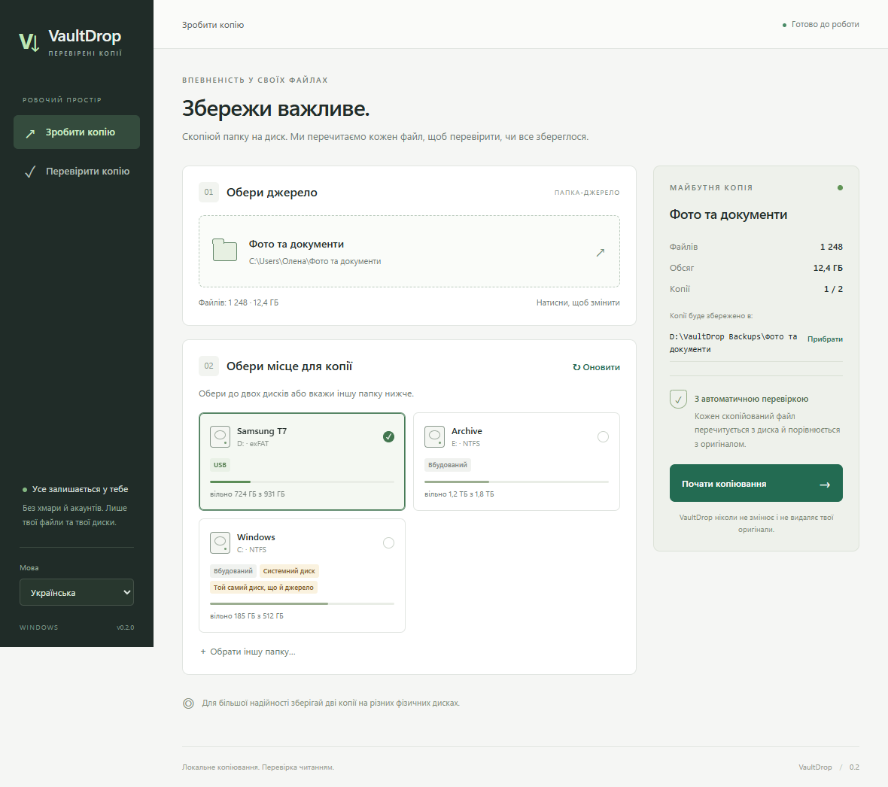
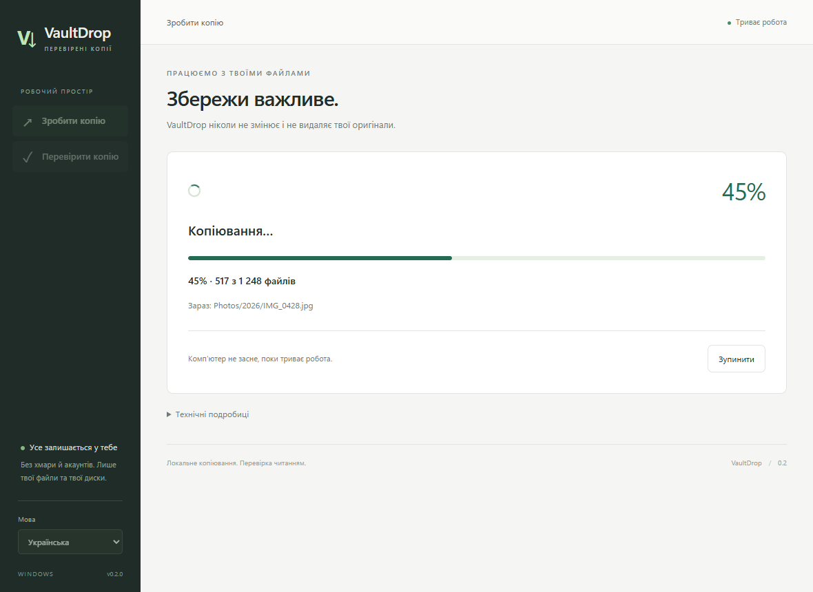
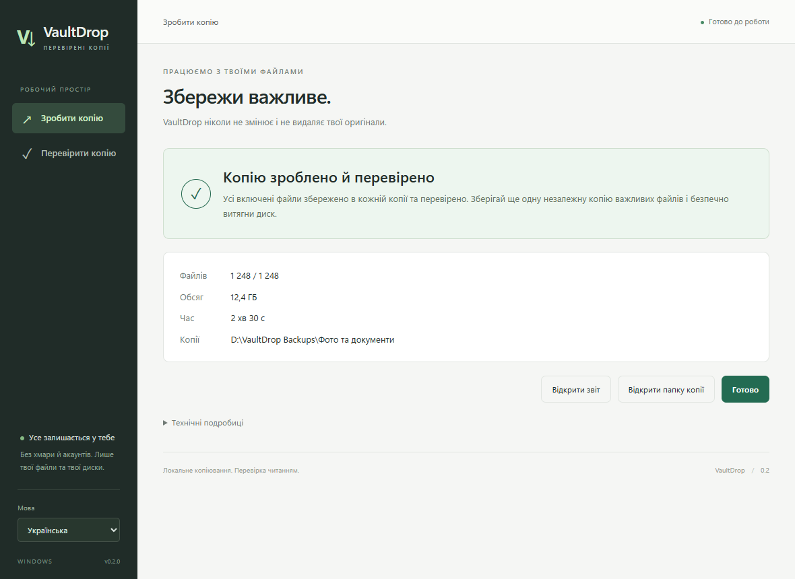
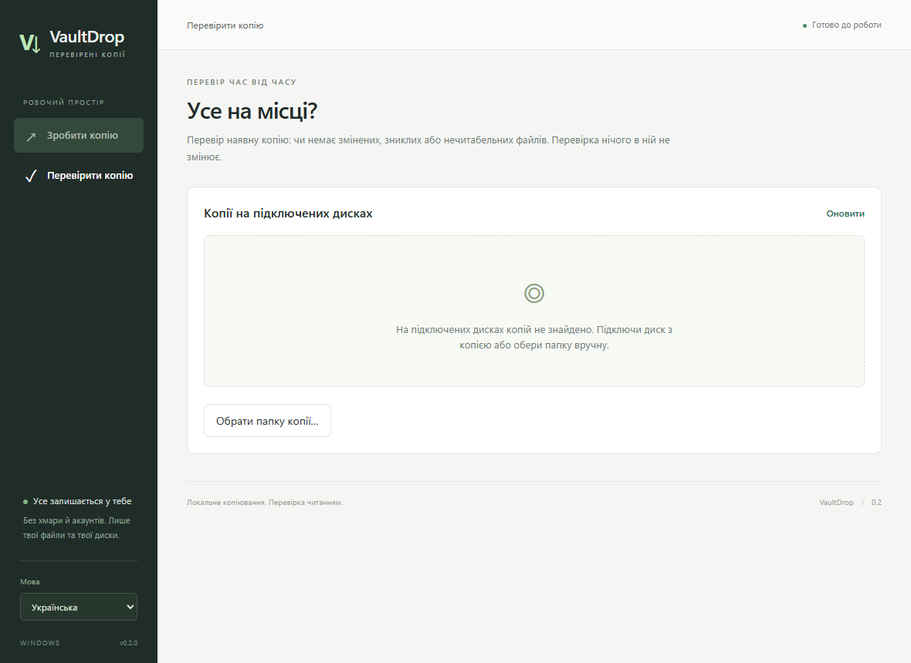
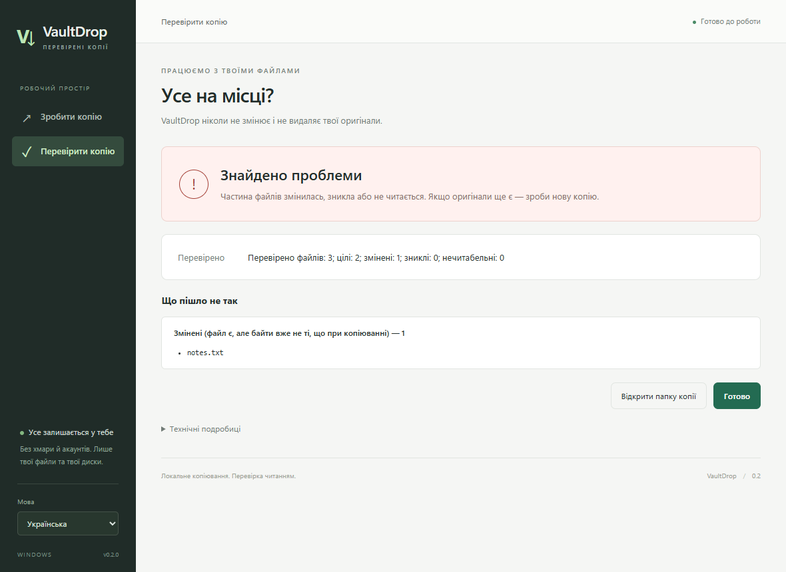
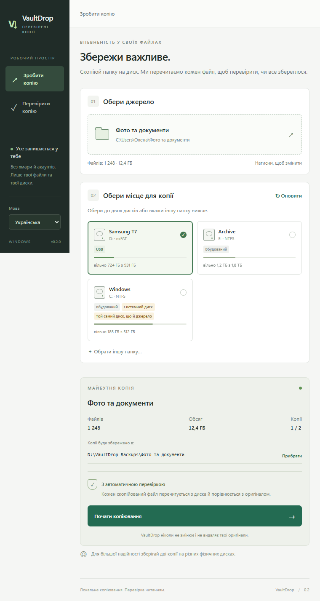

# VaultDrop

[Українська](README.md) · **English**

[](https://github.com/Galactic717/VaultDrop/releases/latest)

[](LICENSE)

Offline folder backups for Windows with read-back verification.


## Download

Get the builds from [Releases](https://github.com/Galactic717/VaultDrop/releases/latest):

- **Installer:** [`VaultDrop_0.2.0_x64-setup.exe`](https://github.com/Galactic717/VaultDrop/releases/latest/download/VaultDrop_0.2.0_x64-setup.exe).
- **Portable:** [`VaultDrop-0.2.0-portable.zip`](https://github.com/Galactic717/VaultDrop/releases/latest/download/VaultDrop-0.2.0-portable.zip) — extract everything and run `VaultDrop Desktop.exe`, keeping the adjacent `vaultdrop.exe` worker in place.
- **CLI only:** [`vaultdrop.exe`](https://github.com/Galactic717/VaultDrop/releases/latest/download/vaultdrop.exe).
- Checksums: `SHA256SUMS.txt` in the same release.

## Screenshots

Shown with the Ukrainian interface; the language can be switched in the app.

| New backup | Progress |
|---|---|
|  |  |
| **Result** | **Check backup** |
|  |  |
| **Damaged backup** | **Compact window** |
|  |  |

## Usage

Choose a source folder, select one or two drives, review the destination paths, then start. Every copied file is flushed, read back while bypassing the Windows cache, and compared with the original. The check-backup view finds existing copies and checks indexed files without modifying the backup. Incomplete and interrupted backups are explicitly distinguished from successful copies.

This release replaces the original interface, adds cancellation, separates process/transport/presentation responsibilities, validates backup-index paths and fields, protects destination boundaries and serializes writers with Windows locks. Original files are read only. Keep independent copies of important data; a successful check is not a guarantee against future drive failure.

Languages: English, Ukrainian, Polish, German, Spanish and French. Windows 10/11 x64 and WebView2 are required; validation was performed on Windows 11. Distribution is unsigned.

```powershell
.\dist\vaultdrop.exe copy --source 'D:\Photos' --to 'E:\Backup\Photos' --lang en
.\dist\vaultdrop.exe verify --target 'E:\Backup\Photos' --lang en
```

`--to` accepts commas and can be repeated for a second destination. `--json` emits JSON Lines. Exit codes: 0 success, 1 incomplete/damaged, 2 execution error. Verification results are `INTACT`, `DAMAGED` and `INCOMPLETE`. The legacy copy verdict `SAFE TO FORMAT` remains in the machine protocol for compatibility.

Build with Python 3.12+, Rust MSVC, Visual Studio Build Tools, Node.js and Microsoft Edge:

```powershell
py -3.12 -m venv .venv
.venv\Scripts\python -m pip install -e '.[dev]'
powershell -NoProfile -ExecutionPolicy Bypass -File build.ps1
```

The build runs core, model and browser tests, produces the CLI, desktop app, installer and portable ZIP, and writes SHA256 checksums. Browser tests inject an explicit host double; the native smoke test exercises the packaged application and real copy engine in a dedicated test directory.

See [reverse engineering and architecture](docs/ARCHITECTURE.md), [validation](docs/VALIDATION.md), [limitations](docs/LIMITATIONS.md), and the [Ukrainian guide](README.md).
