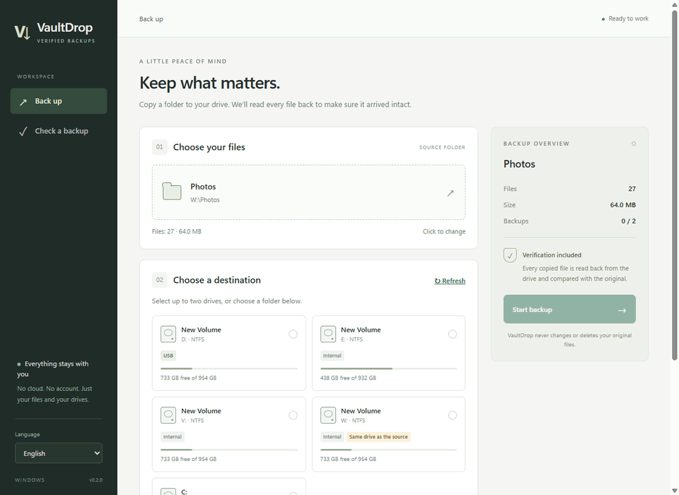
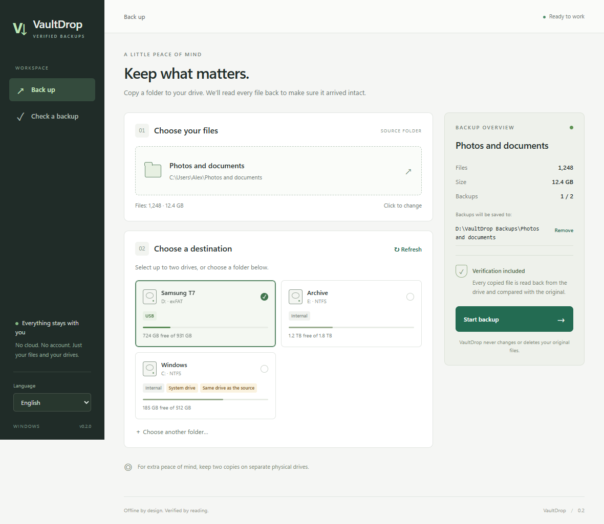
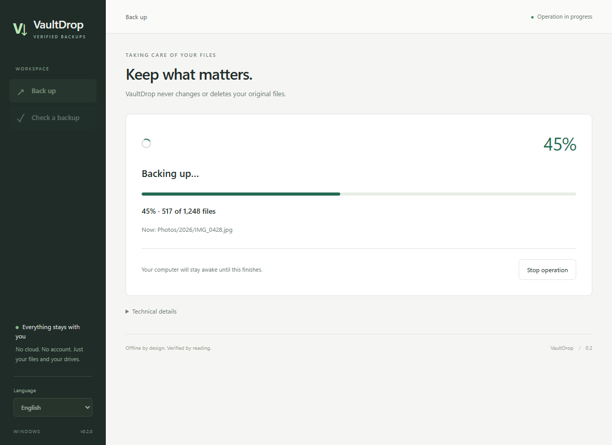
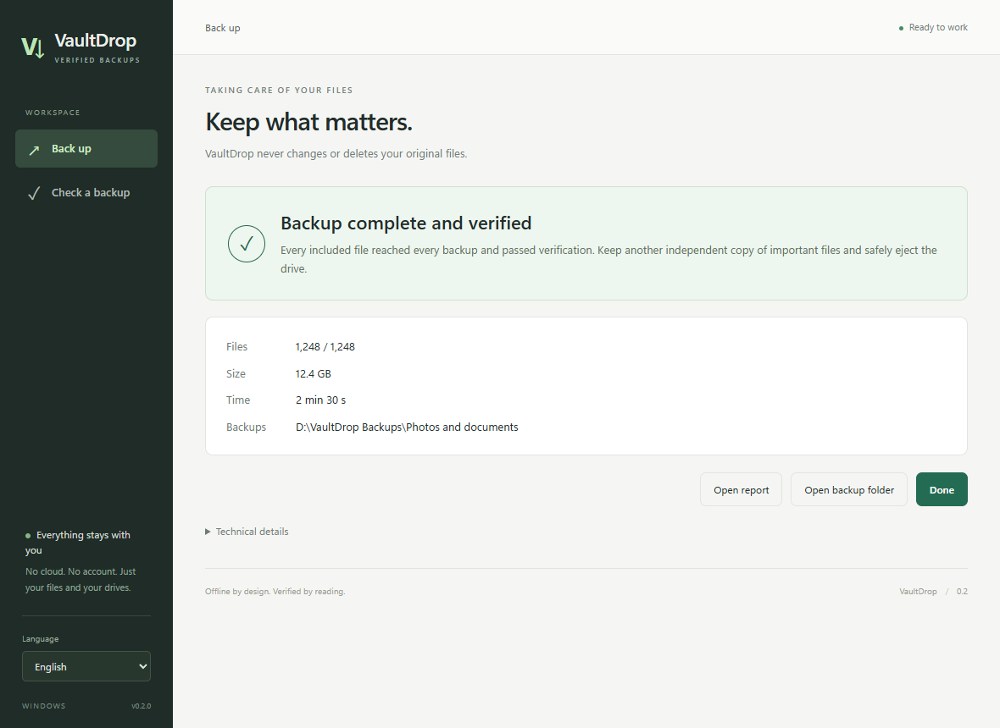
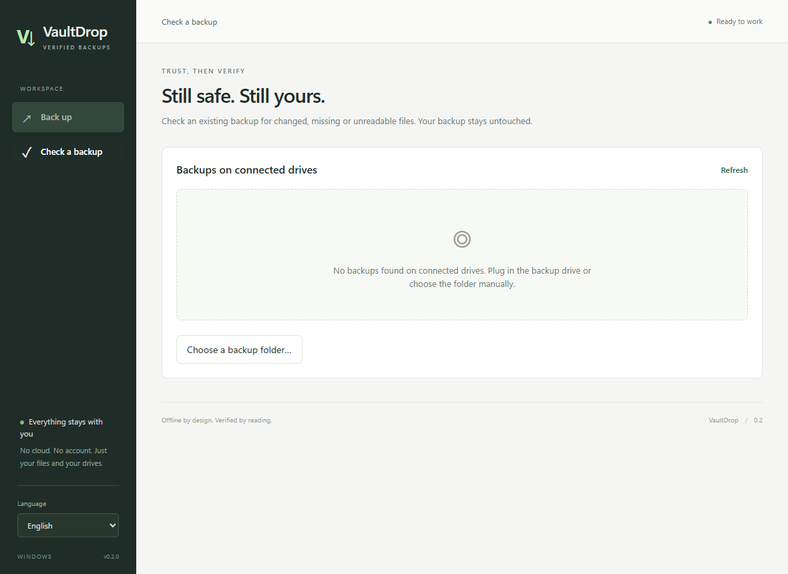
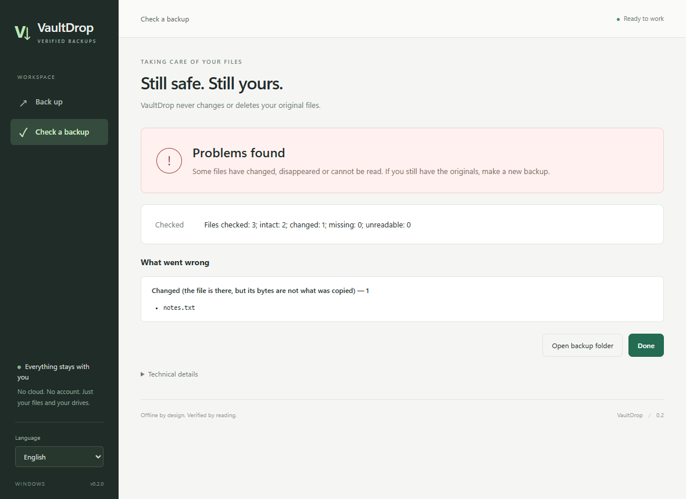
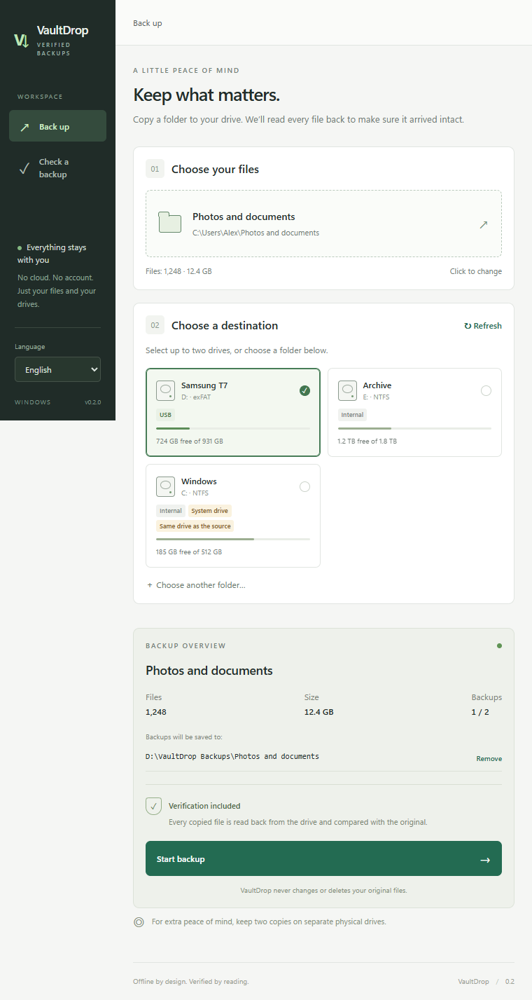

# VaultDrop

[](https://github.com/Galactic717/VaultDrop/releases/latest)

[](LICENSE)

Offline folder backups for Windows that verify every file by reading it back from the disk.



## Download

Get the builds from [Releases](https://github.com/Galactic717/VaultDrop/releases/latest):

- **Installer:** [`VaultDrop_0.2.0_x64-setup.exe`](https://github.com/Galactic717/VaultDrop/releases/latest/download/VaultDrop_0.2.0_x64-setup.exe).
- **Portable:** [`VaultDrop-0.2.0-portable.zip`](https://github.com/Galactic717/VaultDrop/releases/latest/download/VaultDrop-0.2.0-portable.zip). Extract everything and run `VaultDrop Desktop.exe`; keep the adjacent `vaultdrop.exe` (the copy engine) next to it.
- **CLI only:** [`vaultdrop.exe`](https://github.com/Galactic717/VaultDrop/releases/latest/download/vaultdrop.exe).
- Checksums: `SHA256SUMS.txt` in the same release.

Requires Windows 10/11 x64 with WebView2; validated on Windows 11. The installer and executables are not code-signed. The app has no cloud, no accounts and no internet access.

## Screenshots

| New backup | Progress |
|---|---|
|  |  |
| **Result** | **Check a backup** |
|  |  |
| **Damaged backup** | **Compact window** |
|  |  |

## How to use

1. Choose the source folder. The app counts its files and total size.
2. Pick one or two drives, or a custom folder, for the backup. The summary on the right shows the exact destination paths.
3. Click **Start backup**. VaultDrop writes the files, reads them back bypassing the Windows cache and compares checksums.
4. Review the result. An incomplete or stopped operation is never marked as successful. Keep important files on at least one more independent drive.
5. Use Windows "Safely Remove Hardware" before unplugging the drive.

The **Check a backup** tab finds existing backups on your drives; you can also pick a folder manually. Checking never modifies the backup. If the original copy was incomplete or interrupted, the check reports it even when every file listed in the index is intact.

**Stop operation** cancels the operation. Original files are never changed; to finish an incomplete backup, run the copy again. This is a full re-copy, not a resume.

Languages: English, Ukrainian, Polish, German, Spanish and French. The interface starts in English; switch the language in the sidebar.

## What's new in 0.2

- A completely new interface with a backup summary, drive states, and separate screens for checking, progress and results.
- Cancel an operation without closing the app; clear messages for process errors.
- Fixed a false success result for incomplete backups and for report write failures.
- Concurrent writes to the same backup are blocked, index paths are validated, and links inside the destination folder cannot be followed out of it.
- Separate modules for process control, path validation and result presentation; scanning runs in background threads.
- A warning before replacing a backup of a different source that has the same folder name.

More detail: [architecture and reverse engineering](docs/ARCHITECTURE.md), [validation](docs/VALIDATION.md), [limitations](docs/LIMITATIONS.md).

## Command line

```powershell
.\vaultdrop.exe copy --source 'D:\Photos' --to 'E:\Backup\Photos'
.\vaultdrop.exe copy --source 'D:\Photos' --to 'E:\Photos' --to 'F:\Photos'
.\vaultdrop.exe verify --target 'E:\Backup\Photos'
```

`--to` can be repeated for a second destination, and the path may contain commas. `--json` switches output to JSON Lines, and `--lang` selects the report language (English by default). Exit codes: `0` success, `1` incomplete or damaged backup, `2` execution error. The legacy `SAFE TO FORMAT` verdict is kept in the machine-readable report for compatibility; it is not a guarantee that the data will survive forever. Verify returns `INTACT`, `DAMAGED` or `INCOMPLETE`.

## Files inside a backup

| File | Purpose |
|---|---|
| `.vaultdrop.json` and `.vaultdrop.json.xxh64` | Index of copied files and its checksum |
| `vaultdrop-report.txt` / `.json` | Summary of the last copy |
| `vaultdrop-incident.txt` / `.json` | Reasons for errors |
| `.vaultdrop.running` | Copy or service-data write in progress |
| `.vaultdrop.lock` | Permanent service file; the lock is held only while writing |

Old extra files in the backup are not deleted. Symlinks and junctions are not copied. See the limitations for details.

## Development and build

Requires Python 3.12+, Rust (MSVC), Visual Studio Build Tools, Node.js and Microsoft Edge for the browser tests.

```powershell
py -3.12 -m venv .venv
.venv\Scripts\python -m pip install -e '.[dev]'
powershell -NoProfile -ExecutionPolicy Bypass -File build.ps1
```

The script runs the Python and JavaScript tests and the browser scenarios, then builds the CLI, the Tauri app, the NSIS installer and the portable ZIP. Artifacts and `SHA256SUMS.txt` are written to `dist`.

Individual checks:

```powershell
.venv\Scripts\python -m pytest -q
npm --prefix src-app ci
npm --prefix src-app test
npm --prefix src-app run test:ui
```

Layout: `src-core/vaultdrop` is the copy engine, `src-app/ui` the interface, `src-app/src-tauri/src` the Windows shell, and `tests` and `src-app/tests` the tests. Translations are shared by the CLI and the UI: `src-core/vaultdrop/locales`.

## License

[MIT](LICENSE)
